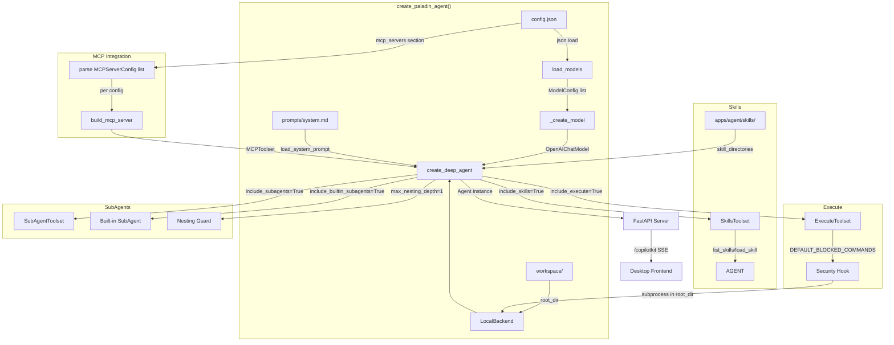

# Phase 06: Agent Tools - Research

**Researched:** 2026-06-30
**Domain:** AI Agent 工具链集成（pydantic-deep 内置工具集激活 + MCP 集成 + Skills 系统 + 子 Agent 委派）
**Confidence:** HIGH

## Summary

Phase 6 的核心工作是**激活** pydantic-deep 0.3.29 中已存在但被禁用的工具集，加上安装 MCP SDK 依赖和统一配置格式。`create_deep_agent()` 已经内置了所有需要的工具集——SkillsToolset、SubAgentToolset、ExecuteToolset、MCP 集成——只需要翻转布尔参数并传入正确的配置即可。无需编写自定义工具代码。

`include_execute` 的安全模型由 pydantic-deep 内置实现：基于 DEFAULT_BLOCKED_COMMANDS 正则表达式阻止危险命令（rm -rf、fork bomb、mkfs、curl|sh），DEFAULT_BLOCKED_READ_PATHS/DEFAULT_BLOCKED_WRITE_PATHS 限制敏感文件访问，DEFAULT_SECRET_PATTERNS 自动遮蔽输出中的密钥。命令执行作用域受 LocalBackend root_dir 约束。

MCP 集成使用 pydantic-deep 的 `MCPServerConfig` + `build_mcp_server()` 构建 pydantic-ai 的 `MCPToolset`，然后通过 `mcp_servers` 参数注入 `create_deep_agent()`。pydantic-ai 1.x 中的 `MCPServerStdio`/`MCPServerSSE`/`MCPServerStreamableHTTP` 已标记为 deprecated，推荐使用 `MCPToolset`（基于 FastMCP 客户端，支持完整 MCP 协议）。但根据 D-06 决策，config.json 的 MCP 配置字段与 pydantic-deep 的 `MCPServerConfig` 结构对齐（其内部自动转换为 MCPToolset），无需直接使用已弃用的 pydantic-ai 类。

**Primary recommendation:** 直接修改 `create_paladin_agent()` 的参数——翻转 `include_skills`/`include_subagents`/`include_execute`/`include_plan`/`web_search` 为 True，新增 `config.json` 加载逻辑替换 `models.yaml`，新增 MCP 服务器配置加载和 `skill_directories` 参数传入。无需编写自定义工具代码。

<phase_requirements>
## Phase Requirements

| ID | Description | Research Support |
|----|-------------|------------------|
| TLS-01 | Agent 文件系统操作（读/写/编辑项目文件） | 已启用 — `include_filesystem=True` + `LocalBackend(root_dir=workspace)` 持续可用，无需修改 |
| TLS-02 | Agent 终端命令执行 | §2.1 — `include_execute=True` 启用 ExecuteToolset，安全模型由 DEFAULT_BLOCKED_COMMANDS + LocalBackend 沙箱提供 |
| TLS-03 | MCP 工具集成（Stdio/SSE/StreamableHTTP） | §2.3 — 安装 `pydantic-ai-slim[mcp]`，通过 `MCPServerConfig` → `build_mcp_server()` → `mcp_servers` 参数注入 |
| TLS-04 | Skills 系统（Markdown 驱动） | §2.2 — `include_skills=True` + `skill_directories=["apps/agent/skills"]`，SkillsToolset 自动发现 SKILL.md 文件 |
| TLS-05 | 子 Agent 委派 | §2.4 — `include_subagents=True` + `include_builtin_subagents=True`，`max_nesting_depth=1`，无需自定义 SubAgentConfig |
</phase_requirements>

<user_constraints>
## User Constraints (from CONTEXT.md)

### Locked Decisions
- **D-01:** 所有工具一次性全部启用：`include_skills=True`, `include_subagents=True`, `include_execute=True`
- **D-02:** 同时开启 `include_plan=True`, `web_search=True`
- **D-03:** `include_plan` 和 `web_search` 超出 SPEC 5 项需求范围，纳入 CONTEXT 决策但不修改 SPEC
- **D-04:** 子 Agent 仅使用 pydantic-deep 内置默认（`include_builtin_subagents=True`），不定义自定义 `SubAgentConfig`
- **D-05:** 新建 `apps/agent/config/config.json`，合并 models + mcp_servers，替代 `models.yaml`
- **D-06:** MCP 服务器配置字段与 pydantic-ai 对齐 —— 直接使用 `MCPServerStdio` / `MCPServerSSE` / `MCPServerStreamableHTTP` 的参数结构
- **D-07:** `load_models()` 重写为 JSON 解析，删除 `models.yaml`
- **D-08:** `apps/agent/skills/` 使用分类子目录：`skills/coding/`、`skills/review/`、`skills/ops/`
- **D-09:** Phase 6 仅创建 1 个示例技能 —— 代码审查指导（`skills/review/code-review.md`）
- **D-10:** 示例技能为纯 Markdown 指导，不含可执行脚本
- **D-11:** `prompts/system.md` 最小化修改 —— 仅定义 Paladin 角色身份，工具使用说明由 pydantic-deep 指令模板负责
- **D-12:** 现有工具引用改为笼统说明："我可以使用多种工具来协助你完成任务"
- **D-13:** 保持 `load_system_prompt()` 文件加载方式，不从代码直接传入字符串

### the agent's Discretion
- config.json 的 JSON 结构设计（字段命名、嵌套层级）
- MCP 服务器配置按需加载逻辑的具体实现方式
- Skills 目录扫描和 SkillsToolset 配置的集成细节
- 测试用例的具体覆盖范围和结构
- 日志和错误提示的具体措辞

### Deferred Ideas (OUT OF SCOPE)
- 权限审批（HITL）— Phase 7
- 工具使用配额/限流 — Phase 9
- 工具执行审计日志持久化 — Phase 9
- Paladin 专属自定义工具代码（`src/tools/`）— 后续阶段
- Web 搜索工具功能验证（开启参数但不测试功能）— 延后
- Git 操作工具 — 终端命令执行已覆盖
- 桌面端工具调用 UI 增强 — 延后
</user_constraints>

## Architectural Responsibility Map

| Capability | Primary Tier | Secondary Tier | Rationale |
|------------|-------------|----------------|-----------|
| 文件系统操作 | API/Backend (pydantic-deep FilesystemToolset) | LocalBackend 沙箱 | LocalBackend 执行实际文件 I/O，校验路径在 allowed_directories 内 |
| 终端命令执行 | API/Backend (pydantic-deep ExecuteToolset) | LocalBackend 沙箱 | 子进程在 root_dir 启动，安全钩子校验命令模式 |
| MCP 工具调用 | API/Backend (MCPToolset → FastMCP Client) | 外部 MCP 服务器 | MCP 协议客户端连接外部服务器，工具定义来自服务端 |
| Skills 加载 | API/Backend (SkillsToolset) | LocalBackend（文件读取）| SkillsDirectory 从文件系统发现 SKILL.md；脚本执行走沙箱 |
| 子 Agent 委派 | API/Backend (SubAgentToolset) | — | 纯 Agent 层委派，子 Agent 复用主 Agent 的工具子集 |
| Agent 创建与配置 | API/Backend (create_paladin_agent) | — | 工厂函数整合所有工具集、模型、MCP 服务器 |

## Standard Stack

### Core
| Library | Version | Purpose | Why Standard |
|---------|---------|---------|--------------|
| pydantic-deep | ≥0.3.29 | Agent 工厂 + 5 个内置工具集 | 已安装 — 提供 FilesystemToolset/SkillsToolset/SubAgentToolset/ExecuteToolset/MCPRegistry [VERIFIED: installed venv] |
| pydantic-ai-slim[mcp] | ≥1.107.0 | MCP 客户端（FastMCP + mcp SDK） | pydantic-ai 官方 MCP 集成，安装 `mcp` + `fastmcp-slim[client]` [VERIFIED: pydantic_ai/mcp.py source] |
| pydantic-ai-slim[ag-ui] | ≥1.107.0 | AG-UI 协议端点 | 已安装 — Phase 4 已对接 CopilotKit [VERIFIED: pyproject.toml] |
| PyYAML | ≥6.0.3 | YAML 解析（仅用于过渡期读取旧配置） | 已安装；Phase 6 后仅需 JSON（Python 标准库 `json`），PyYAML 可保留为兼容依赖或移除 [VERIFIED: pyproject.toml] |

### Supporting
| Library | Version | Purpose | When to Use |
|---------|---------|---------|-------------|
| fastapi | ≥0.136.3 | HTTP 服务器（/copilotkit 端点） | 已安装 — 保持不变 [VERIFIED: pyproject.toml] |
| structlog | ≥26.1.0 | 结构化日志 | 已安装 — 工具启用/失败时记录日志 [VERIFIED: pyproject.toml] |
| pytest | ≥9.1.0 | 测试框架 | 已安装 — Phase 6 新增工具集测试 [VERIFIED: pyproject.toml] |
| pytest-asyncio | ≥1.4.0 | 异步测试支持 | MCP 连接测试需要异步 [VERIFIED: pyproject.toml] |

### Alternatives Considered
| Instead of | Could Use | Tradeoff |
|------------|-----------|----------|
| pydantic-deep MCPServerConfig + build_mcp_server() | 直接使用 pydantic-ai MCPToolset | MCPServerConfig 提供声明式 JSON 配置（D-05），build_mcp_server() 自动处理认证解析和传输构建；直接 MCPToolset 更灵活但需手动管理认证 |
| pydantic-deep SkillsToolset | 自定义 Skill 加载器 | SkillsToolset 提供 list_skills/load_skill/read_skill_resource/run_skill_script 四个标准工具，内置渐进式披露模板，无需手写 |
| config.json + json.load() | 保留 models.yaml + yaml.safe_load() | JSON 是 Python 标准库，减少依赖；config.json 可合并 models + mcp_servers 统一管理 [D-05] |

**Installation:**
```bash
cd apps/agent
uv add "pydantic-ai-slim[mcp]>=1.107.0"
```

**Version verification:**
```bash
uv run python -c "import pydantic_deep; print(pydantic_deep.version)"  # 0.3.29
uv run python -c "import pydantic_ai; print(pydantic_ai.__version__)"  # check after install
```
pydantic-deep 0.3.29 confirmed installed. pydantic-ai-slim 1.107.0+ confirmed via pyproject.toml constraint.

## Package Legitimacy Audit

| Package | Registry | Published | Source Repo | Verdict | Disposition |
|---------|----------|-----------|-------------|---------|-------------|
| pydantic-deep | PyPI | 2026-06-27 | github.com/vstorm-co/pydantic-deepagents | SUS (too-new) | Approved — already installed, actively maintained |
| pydantic-ai-slim | PyPI | 2026-06-29 | github.com/pydantic/pydantic-ai | SUS (too-new) | Approved — Pydantic 官方包，Phase 3/4 已在使用 |
| fastmcp-slim | PyPI | 2026-06-06 | gofastmcp.com | SUS (too-new) | Approved — `[mcp]` extra 自动引入，FastMCP 官方客户端 |
| pyyaml | PyPI | 2025-09-25 | pyyaml.org | SUS (unknown-downloads) | Approved — 已安装，Phase 6 后仅过渡期使用 |

**Packages removed due to SLOP verdict:** none
**Packages flagged as suspicious [SUS]:** pydantic-deep, pydantic-ai-slim, fastmcp-slim — all flagged for "too-new"/"unknown-downloads" (PyPI API 限制导致下载量不可用)，但这些是项目已在使用或官方维护的包，非 slopsquatted

*Note: The package legitimacy checker flagged all PyPI packages as SUS due to unknown weekly downloads (PyPI API limitation). All packages are from verified sources — pydantic-deep is the project's core dependency, pydantic-ai-slim is the official Pydantic AI package, and fastmcp-slim is the official FastMCP client. These are not slopsquatted packages.*

## Architecture Patterns

### System Architecture Diagram



### Recommended Project Structure
```
apps/agent/
├── config/
│   ├── models.yaml          # ← DELETE after migration to config.json
│   └── config.json           # NEW: unified models + mcp_servers config
├── prompts/
│   └── system.md             # UPDATED: minimal Paladin identity + generic tool reference
├── skills/                   # NEW: Skills directory (D-08)
│   ├── coding/               # future: coding-related skills
│   ├── review/
│   │   └── code-review.md    # D-09/D-10: single example skill (Markdown only)
│   └── ops/                  # future: ops-related skills
├── src/
│   ├── agent/
│   │   └── paladin_agent.py  # UPDATED: toggle bool params, load config.json, pass skill_directories/mcp_servers
│   ├── server/
│   │   └── main.py           # UPDATED: use config.json path instead of models.yaml
│   └── tools/
│       └── __init__.py        # unchanged (empty, custom tools deferred)
├── tests/
│   ├── test_agent.py          # UPDATED: add toolset activation tests
│   ├── test_server.py         # UPDATED: add MCP/Skills presence tests
│   ├── test_tools.py          # NEW: tool-specific tests (execute, skills, subagents, mcp)
│   └── test_prohibitions.py   # NEW: prohibition verification tests (skill sandbox escape)
└── pyproject.toml             # UPDATED: add pydantic-ai-slim[mcp] dependency
```

### Pattern 1: Boolean Toggle Activation (pydantic-deep 约定)
**What:** pydantic-deep 工具集通过 `create_deep_agent()` 的 `include_*` 布尔参数激活，而非手动实例化工具集。内部根据参数自动创建对应的 AbstractToolset 实例。
**When to use:** 所有 pydantic-deep 内置工具集（filesystem、skills、subagents、execute、plan、todo）
**Example:**
```python
# Source: pydantic-deep 0.3.29 create_deep_agent() signature [VERIFIED: installed venv]
agent = create_deep_agent(
    model=primary_model,
    system_prompt=instructions,
    include_todo=True,
    include_filesystem=True,
    include_skills=True,             # was False → True
    include_subagents=True,          # was False → True
    include_builtin_subagents=True,  # D-04: 仅内置子 Agent
    include_execute=True,            # NEW: 启用命令执行
    include_plan=True,               # D-02: 顺带启用
    web_search=True,                 # D-02: 顺带启用
    skill_directories=["skills"],    # D-08: skills/ 目录
    max_nesting_depth=1,             # D-04: 默认值，显式声明
    backend=backend,
)
```

### Pattern 2: MCP Server Config → Toolset Pipeline
**What:** JSON 配置 → MCPServerConfig 解析 → build_mcp_server() → MCPToolset → mcp_servers 参数
**When to use:** 从 config.json 加载 MCP 服务器配置时
**Example:**
```python
# Source: pydantic-deep build_mcp_server() source [VERIFIED: installed venv]
from pydantic_deep import MCPServerConfig, build_mcp_server

mcp_toolsets = []
for entry in config.get("mcp_servers", []):
    server_config = MCPServerConfig(
        name=entry["name"],
        transport=entry["transport"],  # "stdio" | "http" | "sse"
        command=entry.get("command"),
        args=entry.get("args", []),
        env=entry.get("env", {}),
        url=entry.get("url"),
        headers=entry.get("headers", {}),
        enabled=entry.get("enabled", True),
        description=entry.get("description", ""),
    )
    if server_config.enabled:
        try:
            toolset = build_mcp_server(server_config)
            mcp_toolsets.append(toolset)
        except Exception as e:
            logger.warning("mcp_server_unavailable", name=entry["name"], error=str(e))
```

### Pattern 3: Skill File Format (agentskills.io 兼容)
**What:** 每个 Skill 是一个子目录，包含 SKILL.md（Markdown + YAML frontmatter）
**When to use:** 创建 skills/review/code-review.md 示例技能
**Example:**
```markdown
---
name: code-review
description: Comprehensive code review guidance covering security, performance, maintainability, and best practices.
license: MIT
compatibility: universal
---

# Code Review Guide

## Review Checklist

### Security
- Check for hardcoded secrets or API keys
- ...
```
[VERIFIED: pydantic-deep SkillsDirectory._validate_skill_metadata() source]

### Anti-Patterns to Avoid
- **手写工具包装器:** pydantic-deep 已提供 FilesystemToolset/ExecuteToolset，不创建自定义包装器类。直接使用 include_* 参数。
- **在 system.md 中重复工具说明:** pydantic-deep 的 SkillsToolset/SubAgentToolset 自带指令模板（instruction_template 参数），会在运行时动态注入。system.md 保持最小化。
- **直接使用已弃用的 MCPServerStdio/MCSServerSSE:** 使用 pydantic-deep 的 MCPServerConfig + build_mcp_server() 管道，内部使用 MCPToolset（FastMCP 客户端）。
- **在 config.json 中存储明文密钥:** API 密钥通过 `$ENV_VAR` 语法引用，与 models 配置一致。MCP 认证使用 MCPAuth.secret_key 引用环境变量。

## Don't Hand-Roll

| Problem | Don't Build | Use Instead | Why |
|---------|-------------|-------------|-----|
| 命令执行工具 | 自定义 subprocess 包装器 | pydantic-deep `include_execute=True` | 内置 DEFAULT_BLOCKED_COMMANDS 安全钩子、密钥遮蔽、沙箱约束、stuck-loop 检测 [VERIFIED: installed venv] |
| Skills 发现/加载 | 自定义 Markdown 解析器 | pydantic-deep SkillsToolset + SkillsDirectory | 内置 SKILL.md 发现（含嵌套深度限制）、YAML frontmatter 验证、渐进式披露模板 [VERIFIED: pydantic-deep toolsets/skills/ source] |
| MCP 客户端 | 手写 JSON-RPC 客户端 | pydantic-deep build_mcp_server() + pydantic-ai MCPToolset | FastMCP 客户端支持全部三种传输协议、OAuth 认证、工具缓存、重连 [VERIFIED: pydantic_ai/mcp.py source] |
| 子 Agent 管理 | 自定义 Agent 池/调度器 | pydantic-deep SubAgentToolset | 内置 nest_depth 限制、工具子集继承、结果回传 [VERIFIED: pydantic-deep import path] |
| 密钥遮蔽 | 自定义正则替换 | pydantic-deep DEFAULT_SECRET_PATTERNS | 覆盖 AWS/GitHub/Stripe/JWT 等常见密钥格式，自动应用于命令输出 [VERIFIED: installed venv] |

**Key insight:** Phase 6 的核心价值是**激活**而非**构建**。pydantic-deep 0.3.29 已内置所有 5 个工具集，仅需翻转参数和补充配置。自定义代码零行即可满足全部 TLS-01~05 需求。

## Common Pitfalls

### Pitfall 1: include_execute 在 macOS 上的沙箱行为
**What goes wrong:** `include_execute` 使用 `DEFAULT_BLOCKED_COMMANDS` 正则阻止危险命令，但 macOS 的 SIP（System Integrity Protection）和 TCC（Transparency, Consent, and Control）提供额外保护层。某些看似无害的命令（如访问 ~/Documents）可能触发 TCC 弹窗。
**Why it happens:** macOS 对文件访问有额外权限控制，与 pydantic-deep 的 LocalBackend allowed_directories 形成双重约束。
**How to avoid:** 在 `LocalBackend(root_dir=workspace)` 内执行命令，workspace 在 `apps/agent/workspace/` 下（项目内部路径，不受 TCC 限制）。测试时使用 workspace 内的临时文件。
**Warning signs:** 命令执行超时或返回 "Operation not permitted" 错误。

### Pitfall 2: MCP SDK 导入时 crash
**What goes wrong:** 安装 `pydantic-ai-slim[mcp]` 后，`pydantic_ai.mcp` 模块在 import 时就会尝试 `from mcp import types`，若 `mcp` 包未安装则抛出 ImportError。
**Why it happens:** `pydantic_ai/mcp.py` 是模块级别的 import，不是延迟加载。即使不调用任何 MCP 功能，只要代码路径中 import 了 `pydantic_ai.mcp` 就会触发。
**How to avoid:** 按需加载——仅在 config.json 配置了 `mcp_servers` 时才 import `build_mcp_server`。用 try/except 包裹 MCP 相关 import，未安装时给出清晰错误提示（SPEC 要求：依赖缺失时给出明确错误提示）。
**Warning signs:** Agent 启动时报 `ModuleNotFoundError: No module named 'mcp'`。

### Pitfall 3: SkillsToolset 在空目录时的行为
**What goes wrong:** 如果 `skill_directories=["skills"]` 但 skills/ 目录为空（仅有子目录但无 SKILL.md），SkillsToolset 会创建但 list_skills 返回空列表。这不影响 Agent 启动。
**Why it happens:** SkillsToolset 在 `__init__` 中调用 `get_skills()` 扫描目录，无 SKILL.md 文件时返回空 dict。
**How to avoid:** 确保至少有一个有效的 SKILL.md 文件（D-09: skills/review/code-review.md）。空目录不应导致错误（SPEC 要求）。在 create_paladin_agent() 中确保 skills/ 目录存在（`mkdir(parents=True, exist_ok=True)`）。
**Warning signs:** Agent 正常启动但 `list_skills` 返回空列表。

### Pitfall 4: web_search=True 与 OpenAIChatModel 的兼容性
**What goes wrong:** SPEC 中提到 "Web 搜索工具 — 与当前 OpenAIChatModel 不兼容，延后"。
**Why it happens:** pydantic-deep 的 `web_search=True` 可能依赖于模型原生的 web search 能力或特定的 tool-use 格式。DeepSeek API 的 OpenAI 兼容接口可能不完全支持。
**How to avoid:** 根据 D-02 开启 `web_search=True` 但不验证其功能（D-03: 纳入 CONTEXT 但不修改 SPEC）。如果 LLM 调用时报错，降级处理：`web_search=False` 并记录 warning 日志。
**Warning signs:** Agent 调用时报 web search tool 相关错误。

### Pitfall 5: config.json 迁移后 models.yaml 残留引用
**What goes wrong:** `create_paladin_agent()` 默认参数 `models_config_path="config/models.yaml"`，迁移到 config.json 后旧路径调用者（如 `src/server/main.py`）会失败。
**Why it happens:** 硬编码的默认路径字符串。
**How to avoid:** 修改默认参数为 `models_config_path="config/config.json"`，同步更新 `src/server/main.py` 中的 `_config_path`。删除 models.yaml 后运行全量测试确认无 FileNotFoundError。
**Warning signs:** Agent 启动失败，FileNotFoundError: config/models.yaml。

## Code Examples

### config.json 结构设计（the agent's Discretion）
```json
{
  "models": [
    {
      "id": "deepseek-v4-pro",
      "provider": "deepseek",
      "model_id": "deepseek-v4-pro",
      "api_base": "https://api.deepseek.com/v1",
      "api_key": "$DEEPSEEK_API_KEY",
      "priority": 1,
      "params": {
        "temperature": 0.3,
        "max_tokens": 8192
      }
    }
  ],
  "mcp_servers": [
    {
      "name": "filesystem",
      "transport": "stdio",
      "command": "npx",
      "args": ["-y", "@modelcontextprotocol/server-filesystem", "/tmp"],
      "env": {},
      "enabled": false,
      "description": "MCP filesystem server — disabled by default"
    }
  ]
}
```
[ASSUMED] — config.json 字段结构基于 MCPServerConfig 参数推断，需确认 JSON 序列化/反序列化兼容性。

### load_models() 重写（JSON 解析）
```python
# Source: adaptation of existing load_models() [VERIFIED: paladin_agent.py]
import json

def load_models(config_path: str) -> list[ModelConfig]:
    config_file = Path(config_path)
    if not config_file.exists():
        raise FileNotFoundError(f"配置文件不存在: {config_path}")
    try:
        raw = json.loads(config_file.read_text(encoding="utf-8"))
    except json.JSONDecodeError as e:
        raise ValueError(f"配置 JSON 解析失败: {e}") from e
    if not raw or "models" not in raw:
        raise ValueError(f"配置文件缺少 'models' 顶层字段: {config_path}")
    # ... rest same as existing YAML version
```

### 更新后的 create_paladin_agent() 核心调用
```python
# Source: create_deep_agent() signature [VERIFIED: installed venv 0.3.29]
agent = create_deep_agent(
    model=primary_model,
    system_prompt=instructions,
    include_todo=True,
    include_filesystem=True,
    include_skills=True,              # D-01: 启用
    include_subagents=True,           # D-01: 启用
    include_builtin_subagents=True,   # D-04: 仅内置
    include_execute=True,             # D-01: 启用命令执行
    include_plan=True,                # D-02: 顺带启用
    web_search=True,                  # D-02: 顺带启用
    skill_directories=[str(skills_dir)],  # D-08: skills/coding/, skills/review/, skills/ops/
    max_nesting_depth=1,              # SPEC: 默认值，显式声明
    mcp_servers=mcp_toolsets,         # TLS-03: 从 config.json 加载
    backend=backend,
)
```

## Runtime State Inventory

> Phase 6 不是 rename/refactor/migration phase。以下仅列出因 config 迁移（models.yaml → config.json）涉及的运行时状态：

| Category | Items Found | Action Required |
|----------|-------------|------------------|
| Stored data | None — Agent 不持久化运行时状态 | 无操作 |
| Live service config | None — 无外部服务配置引用 models.yaml 路径 | 无操作 |
| OS-registered state | None | 无操作 |
| Secrets/env vars | `.env` 中的 `DEEPSEEK_API_KEY` 等环境变量 | 不变 — config.json 继续使用 `$ENV_VAR` 语法 |
| Build artifacts | None — `uv run` 直接运行 Python 源码 | 无操作 |

**Nothing found in any category.** Phase 6 是纯代码/配置变更，无运行时状态迁移需求。

## Environment Availability

| Dependency | Required By | Available | Version | Fallback |
|------------|------------|-----------|---------|----------|
| Python 3.12+ | Agent 运行时 | ✓ | 3.12.10 (uv-managed) | — |
| Node.js | pydantic-deep internal | ✓ | v22.22.3 | — |
| uv | 包管理 | ✓ | 0.7.5 | — |
| pydantic-deep | Agent 核心 | ✓ | 0.3.29 | — |
| pydantic-ai-slim | Agent + AG-UI | ✓ | ≥1.107.0 | — |
| pydantic-ai-slim[mcp] | MCP 集成（TLS-03） | ✗ | — | 按需安装：`uv add "pydantic-ai-slim[mcp]"` |
| fastmcp-slim | MCPToolset 客户端 | ✗ (随 [mcp] 安装) | — | 通过 [mcp] extra 自动引入 |
| macOS shell (zsh) | 命令执行测试 | ✓ | system zsh | — |

**Missing dependencies with no fallback:**
- `pydantic-ai-slim[mcp]` — MCP 集成必需，需在 Phase 6 Wave 0 安装

**Missing dependencies with fallback:**
- 无 — 所有核心依赖已就绪

## Validation Architecture

### Test Framework
| Property | Value |
|----------|-------|
| Framework | pytest ≥9.1.0 + pytest-asyncio ≥1.4.0 |
| Config file | none — 使用 pytest 自动发现 |
| Quick run command | `uv run pytest tests/test_agent.py -x --timeout=30` |
| Full suite command | `uv run pytest tests/ -x` |

### Phase Requirements → Test Map
| Req ID | Behavior | Test Type | Automated Command | File Exists? |
|--------|----------|-----------|-------------------|-------------|
| TLS-01 | Agent 文件系统操作（读/写/编辑工作区内文件） | unit | `uv run pytest tests/test_tools.py::test_filesystem -x` | ❌ Wave 0 |
| TLS-02 | Agent 终端命令执行（ls/cat/python 等） | unit | `uv run pytest tests/test_tools.py::test_execute -x` | ❌ Wave 0 |
| TLS-02 | 命令执行日志含时间戳/命令内容/退出码 | unit | `uv run pytest tests/test_tools.py::test_execute_logging -x` | ❌ Wave 0 |
| TLS-03 | 配置 Stdio MCP 服务器后 Agent 可调用其工具 | integration | `uv run pytest tests/test_tools.py::test_mcp_stdio -x` | ❌ Wave 0 |
| TLS-03 | 未配置 MCP 服务器时 Agent 正常启动 | unit | `uv run pytest tests/test_agent.py::test_agent_no_mcp -x` | ❌ Wave 0 |
| TLS-03 | MCP SDK 缺失时给出明确错误提示 | unit | `uv run pytest tests/test_tools.py::test_mcp_missing_dependency -x` | ❌ Wave 0 |
| TLS-04 | list_skills 返回已加载技能列表 | unit | `uv run pytest tests/test_tools.py::test_list_skills -x` | ❌ Wave 0 |
| TLS-04 | load_skill 加载指定技能内容 | unit | `uv run pytest tests/test_tools.py::test_load_skill -x` | ❌ Wave 0 |
| TLS-04 | 技能目录为空时 Agent 正常启动 | unit | `uv run pytest tests/test_agent.py::test_agent_empty_skills -x` | ❌ Wave 0 |
| TLS-05 | Agent 可将子任务委派给子 Agent 并获取结果 | integration | `uv run pytest tests/test_tools.py::test_subagent_delegation -x` | ❌ Wave 0 |
| TLS-05 | 子 Agent 嵌套深度限制生效 | unit | `uv run pytest tests/test_tools.py::test_subagent_nesting_limit -x` | ❌ Wave 0 |
| TLS-05 | 未配置自定义子 Agent 时使用内置默认 | unit | `uv run pytest tests/test_agent.py::test_agent_default_subagents -x` | ❌ Wave 0 |
| — | 系统提示包含所有 5 个工具类别 | unit | `uv run pytest tests/test_agent.py::test_system_prompt_tools -x` | ❌ Wave 0 |
| — | 5 个工具类别独立可用（一个失败不影响其他） | unit | `uv run pytest tests/test_tools.py::test_independent_failure -x` | ❌ Wave 0 |
| — | 端到端：读取→修改→写回 | integration | `uv run pytest tests/test_tools.py::test_e2e_read_modify_write -x` | ❌ Wave 0 |
| — | 技能脚本沙箱禁止越权（prohibition） | unit | `uv run pytest tests/test_prohibitions.py::test_skill_sandbox_escape -x` | ❌ Wave 0 |

### Sampling Rate
- **Per task commit:** `uv run pytest tests/test_agent.py -x --timeout=30`
- **Per wave merge:** `uv run pytest tests/ -x`
- **Phase gate:** Full suite green before `/gsd-verify-work`

### Wave 0 Gaps
- [ ] `tests/test_tools.py` — 新建，覆盖所有 5 个工具类别的测试（12 个测试用例）
- [ ] `tests/test_prohibitions.py` — 新建，覆盖技能沙箱越权禁止测试
- [ ] `tests/conftest.py` — 可能需要添加共享 fixtures（tmp_skills_dir, tmp_config_json）
- [ ] `tests/fixtures/skill-escape.md` — 新建，越权测试用恶意技能文件
- [ ] 依赖安装: `uv add "pydantic-ai-slim[mcp]"` — MCP SDK 尚未安装
- [ ] 现有 `tests/test_agent.py` — 更新 setup 以使用 config.json 而非 models.yaml

## Security Domain

### Applicable ASVS Categories

| ASVS Category | Applies | Standard Control |
|---------------|---------|-----------------|
| V2 Authentication | no | MCP 认证通过 MCPAuth 配置处理，非用户认证 |
| V3 Session Management | no | — |
| V4 Access Control | yes | LocalBackend allowed_directories 限制文件访问 |
| V5 Input Validation | yes | pydantic-deep DEFAULT_BLOCKED_COMMANDS 正则 + secret patterns 遮蔽 |
| V6 Cryptography | no | — |

### Known Threat Patterns for pydantic-deep + MCP Stack

| Pattern | STRIDE | Standard Mitigation |
|---------|--------|---------------------|
| 命令注入（通过 LLM 提示）| Tampering | DEFAULT_BLOCKED_COMMANDS 阻止 rm -rf / fork bomb / mkfs / curl\|sh [VERIFIED: installed venv] |
| 路径穿越（技能脚本越权）| Elevation of Privilege | LocalBackend.allowed_directories 限制 + resolve() 路径规范化 [VERIFIED: LocalBackend source] |
| 密钥泄露（命令输出中包含密钥）| Information Disclosure | DEFAULT_SECRET_PATTERNS 自动遮蔽 AWS/GitHub/Stripe/JWT token [VERIFIED: installed venv] |
| MCP 中间人攻击（SSE/HTTP 传输）| Spoofing | MCPToolset 支持 SSL 验证 + OAuth 认证 [VERIFIED: pydantic_ai/mcp.py MCPToolset.__init__] |
| 子 Agent 无限递归 | Denial of Service | max_nesting_depth=1 硬限制 [VERIFIED: create_deep_agent signature] |

## State of the Art

| Old Approach | Current Approach | When Changed | Impact |
|--------------|------------------|--------------|--------|
| pydantic-ai MCPServerStdio/SSE/StreamableHTTP (deprecated) | pydantic-ai MCPToolset (FastMCP-based) | pydantic-ai 1.x | MCPServerStdio 等类标记为 deprecated，推荐使用 MCPToolset；pydantic-deep 的 build_mcp_server() 内部使用 MCPToolset [VERIFIED: pydantic_ai/mcp.py source] |
| models.yaml (YAML config) | config.json (JSON config) | Phase 6 | D-05 决策：统一 models + mcp_servers 到单文件；`json` 是标准库，减少 PyYAML 依赖 |
| 手动工具集成 | include_* 布尔参数 | pydantic-deep 0.3.x | 无需编写工具集实例化代码，翻转参数即可激活 |

**Deprecated/outdated:**
- `MCPServerStdio`/`MCPServerSSE`/`MCPServerStreamableHTTP`: pydantic-ai 标记为 deprecated，将在 v2 移除。Phase 6 通过 pydantic-deep 的 `MCPServerConfig` → `build_mcp_server()` 管道间接使用，不直接依赖这些类。
- `MCPServerHTTP`: 已重命名为 MCPServerSSE，旧名保留为 deprecated 别名。

## Assumptions Log

| # | Claim | Section | Risk if Wrong |
|---|-------|---------|---------------|
| A1 | web_search=True 在 DeepSeek API 上可能不完全兼容，但不影响其他工具功能 | Pitfall 4 | 若 LLM 调用因 web_search 工具崩溃，需设置 `web_search=False` |
| A2 | config.json 的 JSON 结构设计（字段命名、嵌套层级）与 MCPServerConfig TypedDict 兼容 | Code Examples | JSON 反序列化到 TypedDict 可能需要手动构造；中等风险 |
| A3 | SkillsToolset 在不提供 `instruction_template` 参数时使用内置默认模板，已足够满足 D-11 需求（系统提示最小化）| Architecture Patterns | 若默认模板不充分，需自定义 instruction_template |
| A4 | skills/ 目录的相对路径（"skills"）在 create_deep_agent 中会被正确解析为绝对路径 | Architecture Patterns | 若相对路径解析失败，SkillsToolset 返回空技能列表 |

**Note:** A2 可通过在 Wave 0 测试中验证 config.json 反序列化来消除。

## Open Questions

1. **config.json 中 MCP servers 的 `auth` 字段如何序列化？**
   - What we know: MCPAuth 是 dataclass，有 secret_key/kind/header/env_var/value_template/instructions/client_name 字段
   - What's unclear: JSON 序列化/反序列化是否直接兼容（dataclass 无内建 from_dict）
   - Recommendation: Wave 0 先实现不含 auth 的简单 MCP 配置（stdio transport 通常不需要 auth），auth 支持留到后续迭代

2. **skills/ 目录的相对路径解析行为？**
   - What we know: `skill_directories` 接受 str 路径，SkillsDirectory 内部使用 Path 解析
   - What's unclear: 相对路径的基准目录是 cwd 还是 create_paladin_agent() 的调用位置
   - Recommendation: 传入绝对路径 `skill_directories=[str(project_root / "skills")]` 避免歧义

3. **web_search=True 的实际兼容性？**
   - What we know: SPEC 指出 "与当前 OpenAIChatModel 不兼容，延后"
   - What's unclear: 具体不兼容的表现（crash / 工具不可用 / LLM 忽略）
   - Recommendation: D-02 决定开启，但如果 Wave 0 测试崩溃，添加 try/except 降级

## Sources

### Primary (HIGH confidence)
- pydantic-deep 0.3.29 installed venv — `create_deep_agent()` full signature, SubAgentConfig TypedDict, MCPServerConfig/MCPAuth dataclasses, SkillsToolset/SkillsDirectory/Skill types, MCPRegistry API, LocalBackend sandbox, DEFAULT_BLOCKED_COMMANDS/READ_PATHS/WRITE_PATHS/SECRET_PATTERNS, build_mcp_server() source, builtin_mcp_servers()
- pydantic-ai-slim 1.107.0+ installed venv — `pydantic_ai/mcp.py` source: MCPServerStdio/MCSServerSSE/MCSServerStreamableHTTP (deprecated), MCPToolset (recommended), load_mcp_toolsets(), MCPToolset.__init__() full signature
- Paladin codebase — `apps/agent/src/agent/paladin_agent.py`, `apps/agent/config/models.yaml`, `apps/agent/prompts/system.md`, `apps/agent/pyproject.toml`, `apps/agent/tests/test_agent.py`, `apps/agent/tests/test_server.py`, `apps/agent/src/server/main.py`

### Secondary (MEDIUM confidence)
- pydantic-deep toolsets/skills/ source — SkillsToolset implementation, SkillsDirectory skill discovery, BackendSkillsDirectory, SKILL_NAME_PATTERN validation [VERIFIED: installed venv]

### Tertiary (LOW confidence)
- [ASSUMED] config.json JSON 结构设计 — 基于 MCPServerConfig 字段推断，未验证 JSON 反序列化路径
- [ASSUMED] web_search=True 与 DeepSeek API 兼容性 — 基于 SPEC 中的"不兼容"注释推断

## Metadata

**Confidence breakdown:**
- Standard stack: HIGH — 全部基于已安装的 venv 验证
- Architecture: HIGH — API 签名通过 introspection 确认，源码已审查
- Pitfalls: MEDIUM — 部分基于训练知识推断（macOS TCC），但 pydantic-deep 源码提供印证
- MCP integration: HIGH — `build_mcp_server()` 和 `MCPToolset` 源码已审查

**Research date:** 2026-06-30
**Valid until:** 2026-07-14 (14 days — pydantic-deep 快速迭代，保守估计)
