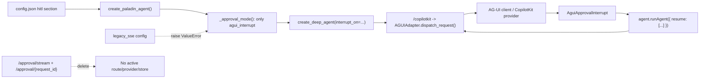

# Phase 07.2: Legacy SSE Approval Cleanup - Research

**Researched:** 2026-07-03
**Domain:** Codebase-only deprecation/removal of a legacy HITL approval transport while preserving official Pydantic AI AG-UI deferred approval
**Confidence:** HIGH for codebase boundaries; MEDIUM for external AG-UI/CopilotKit documentation

<user_constraints>
## User Constraints (from CONTEXT.md)

### Locked Decisions

### Backend Removal Boundary
- **D-01:** Remove the legacy approval implementation itself: `create_approval_callback`, request-id pending maps, `_sse_queue`, `resolve_approval`, and related blocking approval state must not remain as active backend code.
- **D-02:** Do not keep `validate_hitl_config` in a module that remains named and shaped like the legacy HITL implementation if `hitl.py` would otherwise only contain obsolete approval semantics. Planning should prefer moving config validation into `paladin_agent.py` or a neutral config helper before deleting `hitl.py`.
- **D-03:** `apps/agent/src/agent/approval_store.py` is legacy-only for this phase and should be removed unless planning discovers a current official AG-UI dependency.

### Legacy Mode Failure Behavior
- **D-04:** Fail fast during agent/config parsing when `hitl.mode = "legacy_sse"` is explicit.
- **D-05:** `_approval_mode({"hitl": {"mode": "legacy_sse"}})` must raise `ValueError` with a clear message that `legacy_sse` is unsupported and `agui_interrupt` is the only supported approval mode.
- **D-06:** Omitting `hitl.mode` still defaults to `agui_interrupt`. There must be no silent migration branch from `legacy_sse` to `agui_interrupt`.

### Frontend Cleanup Shape
- **D-07:** Phase 07.2 removes the legacy desktop approval channel and does not add a new official pending-status toolbar UI.
- **D-08:** Delete `ApprovalBridge`, `ApprovalDialog`, `ApprovalProvider`, and `useApprovalContext` wiring from active desktop source.
- **D-09:** `ChatToolbar` should drop legacy approval status display while keeping unrelated context/tool-call information intact.
- **D-10:** Official approval cards remain owned by `AguiApprovalInterrupt` in the chat area. A toolbar status for official AG-UI pending interrupts would be a future phase, not part of this cleanup.

### Verification Gates
- **D-11:** Backend verification must prove `legacy_sse` raises, old approval routes are absent or 404, and official `/copilotkit` AG-UI delegation/resume behavior remains intact.
- **D-12:** Frontend verification must prove `AguiApprovalInterrupt` remains mounted and can submit official `resume[]` payloads after deleting the legacy bridge/dialog/provider.
- **D-13:** Source-search gates are hard acceptance checks for active source/tests. Active code must not retain `ApprovalBridge`, `ApprovalDialog`, `ApprovalProvider`, `useApprovalContext`, `/approval/stream`, `/approval/{request_id}`, `create_approval_callback`, `_pending_approvals`, `_pending_decisions`, `_sse_queue`, `resolve_approval`, or `approval_store`.
- **D-14:** Historical `.planning` references may remain when they describe prior behavior or this cleanup. Active docs must not advertise legacy SSE as an available fallback after 07.2.

### the agent's Discretion
- The planner may choose the exact destination for retained config validation as long as the legacy approval implementation is not kept alive and the official AG-UI path remains unchanged.
- The planner may split backend, frontend, tests, and active-doc cleanup into separate plan files if that produces clearer verification gates.

### Deferred Ideas (OUT OF SCOPE)
- Official AG-UI pending approval status in `ChatToolbar` is deferred. Phase 07.2 should remove legacy toolbar status without adding this new UI behavior.

### Reviewed Todos (not folded)
- `implement-resizable-sidebar.md` — Matched Phase 07.2 only because of a generic `store` keyword. It is a sidebar/layout task and is not part of legacy SSE approval cleanup.
</user_constraints>

<phase_requirements>
## Phase Requirements

| ID | Description | Research Support |
|----|-------------|------------------|
| 07.2-R1 | Remove legacy mode selection; explicit `hitl.mode = "legacy_sse"` must raise. | `_approval_mode()` currently accepts `legacy_sse`; rewrite tests first. [VERIFIED: codebase grep] |
| 07.2-R2 | Remove backend `/approval/stream` and `/approval/{request_id}` plus broadcast infrastructure. | `server/main.py` owns all route and queue lifecycle code. [VERIFIED: codebase grep] |
| 07.2-R3 | Remove request-id callback/store code and legacy-only backend tests. | `hitl.py`, `approval_store.py`, `test_hitl.py`, and `test_approval_store.py` are the active legacy cluster. [VERIFIED: codebase grep] |
| 07.2-R4 | Remove desktop legacy bridge/dialog/provider/status wiring. | `ApprovalBridge.tsx`, `ApprovalDialog.tsx`, `App.tsx`, and `ChatToolbar.tsx` contain the EventSource/context path. [VERIFIED: codebase grep] |
| 07.2-R5 | Clean legacy-only tests and active docs. | Active source/tests and `docs/superpowers/*` still mention the fallback; historical `.planning` may remain. [VERIFIED: codebase grep] |
| 07.2-R6 | Preserve official AG-UI approval behavior. | `AguiApprovalInterrupt.tsx`, agent `interrupt_on`, `/copilotkit` adapter delegation, and existing tests encode the official path. [VERIFIED: codebase grep] |
</phase_requirements>

## Summary

Phase 07.2 is a removal/refactor phase, not a new approval feature. The correct plan is to delete the request-id SSE approval transport, fail fast on explicit `legacy_sse`, and leave the official AG-UI path untouched except for regression tests. [VERIFIED: `.planning/phases/07.2-legacy-sse-approval-cleanup/07.2-SPEC.md`]

The main sequencing constraint is that `apps/agent/src/agent/hitl.py` currently contains both legacy request-id approval code and still-useful `validate_hitl_config()`. Move or inline validation first, then remove the legacy module import, callback branch, `_hitl_sse_queue`, server route bridge, desktop EventSource provider/dialog, and legacy-only tests. [VERIFIED: codebase grep]

**Primary recommendation:** Use one cleanup plan with four waves: backend config/mode cleanup, backend route/store deletion, frontend bridge/dialog/status deletion, and verification/docs source-search gates. [ASSUMED]

## Project Constraints (from AGENTS.md)

No `./AGENTS.md` file exists in the project root during research. [VERIFIED: filesystem]

Runtime instruction from the user requires Chinese for user-facing summaries; the artifact keeps GSD headings and code identifiers in project style. [VERIFIED: prompt]

## Architectural Responsibility Map

| Capability | Primary Tier | Secondary Tier | Rationale |
|------------|-------------|----------------|-----------|
| HITL approval mode parsing | API / Backend | Configuration | `create_paladin_agent()` reads `hitl.mode` and controls `interrupt_on` vs legacy callback branch. [VERIFIED: `apps/agent/src/agent/paladin_agent.py`] |
| Official approval interruption | API / Backend | Browser / Client | Backend supplies Pydantic Deep `interrupt_on` and `Tool(..., requires_approval=True)`; frontend renders and resumes AG-UI interrupts. [VERIFIED: codebase grep] |
| Legacy SSE approval transport | API / Backend | Browser / Client | FastAPI routes broadcast request-id events; desktop EventSource receives and POSTs decisions. Remove both sides. [VERIFIED: codebase grep] |
| Approval state persistence/history | Database / Storage | API / Backend | `approval_store.py` is local JSON persistence but has no current official AG-UI dependency. Remove for 07.2. [VERIFIED: codebase grep] |
| Toolbar approval status | Browser / Client | — | Current status reads legacy `ApprovalContext`; official pending-status UI is deferred. [VERIFIED: `07.2-CONTEXT.md`] |

## Standard Stack

### Core

| Library | Version | Purpose | Why Standard |
|---------|---------|---------|--------------|
| `pydantic-ai[ag-ui]` | `>=2.3.0` in `apps/agent/pyproject.toml` | Official AG-UI adapter and deferred approval resume handling | Existing Phase 07.1 default path and tests depend on `AGUIAdapter.dispatch_request()`. [VERIFIED: codebase grep] |
| `pydantic-deep` | `>=0.3.34` in `apps/agent/pyproject.toml` | Deep agent creation and `interrupt_on` deferred approval configuration | Existing agent factory passes `interrupt_on` into `create_deep_agent()`. [VERIFIED: codebase grep] |
| `@ag-ui/client` | `^0.0.57` in `apps/desktop/package.json` | Frontend AG-UI client and `ResumeEntry` types | `AguiApprovalInterrupt` imports `Interrupt` and `ResumeEntry`. [VERIFIED: codebase grep] |
| `@copilotkit/react-core` | `^1.60.1` in `apps/desktop/package.json` | CopilotKit provider, `useAgent`, `useCopilotKit` | Existing official approval component subscribes to agent events and sets an interrupt element. [VERIFIED: codebase grep] |

### Supporting

| Library | Version | Purpose | When to Use |
|---------|---------|---------|-------------|
| FastAPI | `>=0.136.3` | `/copilotkit`, `/health`, route absence checks | Keep `/copilotkit`; delete only legacy approval routes. [VERIFIED: codebase grep] |
| Vitest + Testing Library | Vitest `^4.1.8`, Testing Library `^16.3.2` | Frontend regression for `AguiApprovalInterrupt` and toolbar/App cleanup | Use targeted test before full build. [VERIFIED: `apps/desktop/package.json`] |
| pytest | `>=9.1.0` dev dependency | Backend unit/server regression | Use targeted agent/server tests and source-search gates. [VERIFIED: `apps/agent/pyproject.toml`] |

### Alternatives Considered

| Instead of | Could Use | Tradeoff |
|------------|-----------|----------|
| Deleting legacy SSE | Keeping disabled compatibility shims | Contradicts locked D-01/D-13 and leaves route/symbol residue. [VERIFIED: `07.2-CONTEXT.md`] |
| Moving `validate_hitl_config()` into a neutral helper | Keeping `hitl.py` with only validation | D-02 explicitly discourages retaining a legacy-shaped module. [VERIFIED: `07.2-CONTEXT.md`] |
| Adding official toolbar pending status | Implement new AG-UI pending status display | Out of scope and deferred by D-07/D-10. [VERIFIED: `07.2-CONTEXT.md`] |

**Installation:** No new packages are required for this phase. [VERIFIED: codebase grep]

## Package Legitimacy Audit

Skipped. Phase 07.2 should not install external packages; it removes code and preserves already-installed stack entries. [VERIFIED: phase scope]

## Architecture Patterns

### System Architecture Diagram



### Recommended Project Structure

```text
apps/agent/src/agent/
  paladin_agent.py        # approval mode parsing + retained hitl config validation
  computer_use.py         # unchanged Computer Use tools
apps/agent/src/server/
  main.py                 # /copilotkit, /health, /info; no legacy approval routes
apps/desktop/src/components/approval/
  ApprovalCard.tsx        # reusable card, keep
  AguiApprovalInterrupt.tsx # official AG-UI approval renderer, keep
```

### Pattern 1: Fail Fast on Explicit Legacy Mode

**What:** `_approval_mode({})` returns `agui_interrupt`; `_approval_mode({"hitl": {"mode": "legacy_sse"}})` raises `ValueError`. [VERIFIED: `07.2-SPEC.md`]

**When to use:** Before constructing `ToolGuard`, so no callback branch can be reached. [VERIFIED: codebase grep]

**Example:**

```python
def _approval_mode(raw_config: dict) -> str:
    mode = raw_config.get("hitl", {}).get("mode", "agui_interrupt")
    if mode == "legacy_sse":
        raise ValueError("Unsupported hitl.mode: legacy_sse; use agui_interrupt")
    if mode != "agui_interrupt":
        raise ValueError(f"Unsupported hitl.mode: {mode}")
    return mode
```

### Pattern 2: Preserve Official AG-UI Delegation

**What:** `/copilotkit` should continue replaying the request body and calling `AGUIAdapter.dispatch_request(request=..., agent=..., deps=...)`. [VERIFIED: `apps/agent/src/server/main.py`]

**Why:** Pydantic AI AG-UI docs state `RunAgentInput.resume[]` is translated into deferred tool approval results and malformed payloads deny by default. [CITED: https://pydantic.dev/docs/ai/api/ui/ag_ui/]

### Pattern 3: Keep Official Frontend Interrupt Ownership in Chat

**What:** `AguiApprovalInterrupt` subscribes to `onRunFinishedEvent`, filters `reason === "tool_call"`, and calls `agent.runAgent({ resume })`. [VERIFIED: `apps/desktop/src/components/approval/AguiApprovalInterrupt.tsx`]

**Why:** CopilotKit docs describe a standard AG-UI interrupt flow based on `RUN_FINISHED` outcomes and a legacy custom-event flow; 07.2 preserves the standard path and deletes Paladin's separate SSE transport. [CITED: https://docs.showcase.copilotkit.ai/reference/v2/hooks/useInterrupt]

### Anti-Patterns to Avoid

- **Compatibility shim for `legacy_sse`:** Do not auto-map it to `agui_interrupt`; locked D-06 forbids silent migration. [VERIFIED: `07.2-CONTEXT.md`]
- **Dead active symbols:** Do not leave `create_approval_callback`, `_sse_queue`, or `ApprovalBridge` in active source "just unused"; D-13 makes source absence a hard gate. [VERIFIED: `07.2-CONTEXT.md`]
- **Removing `ApprovalCard`:** The legacy bridge/dialog are deletion targets, but `ApprovalCard` is used by `AguiApprovalInterrupt` and should remain. [VERIFIED: codebase grep]
- **Frontend toolbar expansion:** Do not replace legacy toolbar status with a new official AG-UI status. [VERIFIED: `07.2-CONTEXT.md`]

## Don't Hand-Roll

| Problem | Don't Build | Use Instead | Why |
|---------|-------------|-------------|-----|
| AG-UI resume conversion | Paladin-side resume-to-deferred-result bridge | `AGUIAdapter.dispatch_request()` | Official adapter already maps `resume[]`; local bridge would reintroduce drift. [CITED: https://pydantic.dev/docs/ai/api/ui/ag_ui/] |
| Approval event bus | Custom SSE/EventSource channel | AG-UI run-finished interrupt and `agent.runAgent({ resume })` | Existing official component and tests already cover this path. [VERIFIED: codebase grep] |
| Approval history persistence | Local `approval_store.py` | Nothing in 07.2; future Phase 09 audit/admin if needed | Audit log persistence is explicitly out of scope. [VERIFIED: `07.2-SPEC.md`] |
| Toolbar pending UI | New status system | Delete legacy status only | Official pending toolbar status is deferred. [VERIFIED: `07.2-CONTEXT.md`] |

**Key insight:** The cleanup is safest when it reduces active approval surfaces to one protocol path: `/copilotkit` plus official AG-UI interrupt/resume. [VERIFIED: codebase grep]

## Runtime State Inventory

| Category | Items Found | Action Required |
|----------|-------------|-----------------|
| Stored data | `approval_store.py` writes local JSON records, but no configured runtime path or active official AG-UI dependency was found. [VERIFIED: codebase grep] | Delete module and tests; no data migration planned unless executor finds a real configured store path outside git. |
| Live service config | No external service config for `/approval/stream` or `legacy_sse` found in active source/config. [VERIFIED: codebase grep] | No live service migration. |
| OS-registered state | No launchd/systemd/pm2/Tauri sidecar registrations for the legacy approval route found in active project files. [VERIFIED: codebase grep] | None. |
| Secrets/env vars | No env var names for `legacy_sse`, approval routes, or approval store were found. Shell glob for `.env*` failed in zsh, so planner may add one explicit `find . -name '.env*'` check if desired. [VERIFIED: command output] | No known env migration; add optional pre-implementation check. |
| Build artifacts | `apps/desktop/node_modules` and Python virtualenv artifacts are not part of active source gates; no build artifact rewrite is needed. [ASSUMED] | Run tests/build after deletion; no migration. |

## Common Pitfalls

### Pitfall 1: Deleting `hitl.py` Before Moving Validation

**What goes wrong:** `paladin_agent.py` imports both `create_approval_callback` and `validate_hitl_config`; deleting `hitl.py` too early breaks agent creation. [VERIFIED: codebase grep]

**How to avoid:** First move validation into `paladin_agent.py` or `src.agent.hitl_config`, update imports/tests, then remove callback/store symbols. [VERIFIED: `07.2-CONTEXT.md`]

### Pitfall 2: Server Route Absence Without Route Table Test

**What goes wrong:** Source deletion can miss an imported router or stale endpoint. [ASSUMED]

**How to avoid:** Add server tests that inspect `main.app.routes` or assert GET/POST return 404 for `/approval/stream` and `/approval/anything`. [VERIFIED: `07.2-SPEC.md`]

### Pitfall 3: Removing the Wrong Approval UI

**What goes wrong:** `ApprovalBridge` and `ApprovalDialog` are legacy deletion targets, but `ApprovalCard` and `AguiApprovalInterrupt` are official-path assets. [VERIFIED: codebase grep]

**How to avoid:** Frontend plan must delete only legacy bridge/dialog/provider/status wiring and keep `AguiApprovalInterrupt` mounted from `ChatArea` or its existing parent. [VERIFIED: `07.2-CONTEXT.md`]

### Pitfall 4: Source Search Over `.planning` Creates False Failures

**What goes wrong:** Historical Phase 07 and 07.1 artifacts intentionally mention legacy SSE. [VERIFIED: codebase grep]

**How to avoid:** Acceptance search should cover `apps/**`, active docs such as `docs/superpowers/**`, `README.md`, and current `ROADMAP/STATE/PROJECT`; allow historical `.planning/phases/07*` chronology when explicitly historical. [VERIFIED: `07.2-CONTEXT.md`]

### Pitfall 5: Full Frontend Build May Hit Known Non-Approval Errors

**What goes wrong:** Prior context notes unrelated `Titlebar` TypeScript build errors may exist. [VERIFIED: `07.2-SPEC.md`]

**How to avoid:** Run targeted Vitest and `tsc`/build for visibility; only block 07.2 on approval-related failures unless the unrelated blocker has already been fixed. [VERIFIED: `07.2-SPEC.md`]

## Code Examples

### Route Absence Test

```python
def test_legacy_approval_routes_are_not_registered():
    from src.server import main

    paths = {route.path for route in main.app.routes}
    assert "/approval/stream" not in paths
    assert "/approval/{request_id}" not in paths
```

### Official Resume Preservation Test Pattern

```python
async def fake_dispatch_request(*, request, agent, deps):
    captured["body"] = await request.json()
    return Response("adapter-ok", status_code=202)

monkeypatch.setattr(main.AGUIAdapter, "dispatch_request", fake_dispatch_request)
response = client.post("/copilotkit", json={"messages": [], "resume": [{"interruptId": "int-1", "status": "resolved", "payload": {"approved": True}}]})
assert captured["body"]["resume"][0]["payload"] == {"approved": True}
```

### Frontend Source-Ownership Gate

```bash
rg -n "ApprovalBridge|ApprovalDialog|ApprovalProvider|useApprovalContext|/approval/stream|/approval/\\{request_id\\}" apps/desktop/src
```

Expected after cleanup: no matches. [VERIFIED: `07.2-CONTEXT.md`]

## State of the Art

| Old Approach | Current Approach | When Changed | Impact |
|--------------|------------------|--------------|--------|
| Paladin-owned request-id SSE approval fallback | Pydantic AI AG-UI deferred approval through `/copilotkit` | Phase 07.1, completed 2026-07-03 | 07.2 can delete fallback and keep official tests. [VERIFIED: `07.1-07.2-HANDOFF.md`] |
| Desktop EventSource bridge/dialog | `AguiApprovalInterrupt` subscribes to AG-UI run-finished interrupts and sends `resume[]` | Phase 07.1 UAT/debug fix | Delete bridge/dialog; preserve chat card. [VERIFIED: codebase grep] |
| `legacy_sse` selectable mode | `agui_interrupt` only, explicit legacy config raises | Phase 07.2 target | Rewrite `_approval_mode` tests. [VERIFIED: `07.2-SPEC.md`] |

**Deprecated/outdated:**
- `apps/agent/src/agent/hitl.py` callback/store semantics: legacy request-id approval state; remove after moving validation. [VERIFIED: codebase grep]
- `apps/agent/src/agent/approval_store.py`: legacy-only local approval record store; remove unless an executor discovers a current official dependency. [VERIFIED: `07.2-CONTEXT.md`]
- `ApprovalBridge.tsx` and `ApprovalDialog.tsx`: old EventSource/modal approval channel; remove. [VERIFIED: codebase grep]

## Assumptions Log

| # | Claim | Section | Risk if Wrong |
|---|-------|---------|---------------|
| A1 | One cleanup plan with four waves is the best planning shape. | Summary | Planner may split into multiple plan files if clearer. |
| A2 | No build artifact rewrite is needed. | Runtime State Inventory | Executor may find generated artifacts with active imports; add search gate. |
| A3 | Route absence test can use route table plus 404 checks. | Common Pitfalls / Validation | Test client behavior may require importing server with env patching, as existing tests do. |

## Open Questions (RESOLVED)

1. **Should active `docs/superpowers/*` be considered active docs or historical notes?**
   - What we know: They still describe `/approval/stream`, `ApprovalDialog`, and `approval_store.py`. [VERIFIED: codebase grep]
   - RESOLVED: Treat `docs/superpowers/specs/2026-07-01-ag-ui-tool-approval-design.md`, `docs/superpowers/plans/2026-07-01-ag-ui-tool-approval.md`, and `docs/diagrams/permission-approval-current-design.excalidraw` as active docs for this cleanup. Plan 04 covers updating or classifying them so active docs no longer advertise legacy SSE as an available fallback. [VERIFIED: plan-checker feedback and `07.2-04-PLAN.md`]

2. **Is `ApprovalCard` mounted only through `AguiApprovalInterrupt`?**
   - What we know: `AguiApprovalInterrupt` imports and renders `ApprovalCard`. [VERIFIED: codebase grep]
   - RESOLVED: Plan 03 preserves `AguiApprovalInterrupt`, `ApprovalCard`, and `ChatArea` as the official approval UI path, and Plan 05 adds the final source gate proving `AguiApprovalInterrupt`, `ApprovalCard`, `setInterruptElement`, and official `agent.runAgent({ resume })` submission remain present after App cleanup. [VERIFIED: `07.2-CONTEXT.md`, `07.2-03-PLAN.md`, `07.2-05-PLAN.md`]

## Environment Availability

| Dependency | Required By | Available | Version | Fallback |
|------------|-------------|-----------|---------|----------|
| Python | Backend tests | Yes | `python3 3.9.6` system; project requires `>=3.12` in `pyproject.toml` | Use `uv run` in `apps/agent` to select project Python. [VERIFIED: command output] |
| Node.js | Desktop tests/build | Yes | `v22.22.3` | None needed. [VERIFIED: command output] |
| npm | Package metadata/scripts | Yes | `10.9.8` | Use pnpm for project scripts. [VERIFIED: command output] |
| pnpm | Desktop scripts | Yes | `11.7.0` | npm could run scripts but lock/tooling likely expects pnpm. [VERIFIED: command output] |
| uv | Agent dependency/test runner | Yes | `0.7.5` | Direct pytest only if env already active. [VERIFIED: command output] |
| pytest CLI | Backend tests | Not found in root PATH output | — | Use `uv run pytest` from `apps/agent`. [VERIFIED: command output] |

**Missing dependencies with no fallback:** None known. [VERIFIED: command output]

**Missing dependencies with fallback:** Root `pytest` unavailable; use `uv run pytest`. [VERIFIED: command output]

## Validation Architecture

### Test Framework

| Property | Value |
|----------|-------|
| Backend framework | pytest via `apps/agent/pyproject.toml` |
| Backend config file | `apps/agent/pyproject.toml`; no separate `pytest.ini` found |
| Backend quick run command | `cd apps/agent && uv run pytest tests/test_agent.py tests/test_server.py -q` |
| Backend legacy-delete command | `cd apps/agent && uv run pytest tests/test_agent.py::test_hitl_mode_defaults_to_agui_interrupt tests/test_server.py -q` plus source-search gates |
| Frontend framework | Vitest via `apps/desktop/package.json` |
| Frontend quick run command | `cd apps/desktop && pnpm vitest run src/components/approval/__tests__/AguiApprovalInterrupt.test.tsx` |
| Full suite command | Backend: `cd apps/agent && uv run pytest`; Frontend: `cd apps/desktop && pnpm vitest run`; build: `cd apps/desktop && pnpm build` for visibility |

### Phase Requirements to Test Map

| Req ID | Behavior | Test Type | Automated Command | File Exists? |
|--------|----------|-----------|-------------------|--------------|
| 07.2-R1 | Default is `agui_interrupt`; explicit `legacy_sse` raises | unit | `cd apps/agent && uv run pytest tests/test_agent.py::test_hitl_mode_defaults_to_agui_interrupt tests/test_agent.py::test_hitl_mode_rejects_legacy_sse -q` | Needs rewrite |
| 07.2-R2 | `/approval/stream` and `/approval/{request_id}` absent | server unit/integration | `cd apps/agent && uv run pytest tests/test_server.py -q` | Needs new tests |
| 07.2-R3 | No request-id callback/store active symbols | source gate | `rg -n "create_approval_callback|_pending_approvals|_pending_decisions|_sse_queue|resolve_approval|approval_store" apps/agent/src apps/agent/tests` | Existing matches to remove |
| 07.2-R4 | No legacy desktop bridge/dialog/provider/status | source gate + Vitest | `rg -n "ApprovalBridge|ApprovalDialog|ApprovalProvider|useApprovalContext|/approval/stream|/approval/\\{request_id\\}" apps/desktop/src` | Existing matches to remove |
| 07.2-R5 | Active docs no longer advertise fallback | docs source gate | `rg -n "legacy_sse|/approval/stream|/approval/\\{request_id\\}|ApprovalBridge|ApprovalDialog|approval_store" README.md docs .planning/PROJECT.md .planning/ROADMAP.md .planning/STATE.md` | Existing matches to classify/update |
| 07.2-R6 | Official AG-UI resume/interrupt behavior preserved | backend + frontend regression | `cd apps/agent && uv run pytest tests/test_agent.py tests/test_server.py tests/test_agui_dependency_probe.py -q`; `cd apps/desktop && pnpm vitest run src/components/approval/__tests__/AguiApprovalInterrupt.test.tsx` | Existing tests mostly present |

### Sampling Rate

- **Per task commit:** Targeted test for touched tier plus source-search gate. [ASSUMED]
- **Per wave merge:** Backend or frontend quick run for changed tier. [ASSUMED]
- **Phase gate:** Backend pytest subset, frontend approval Vitest, source-search gates, and docs gate. [VERIFIED: `07.2-SPEC.md`]

### Wave 0 Gaps

- [ ] Rewrite `apps/agent/tests/test_agent.py::test_hitl_mode_allows_legacy_sse_fallback` into `test_hitl_mode_rejects_legacy_sse`. [VERIFIED: codebase grep]
- [ ] Add `apps/agent/tests/test_server.py` route absence checks. [VERIFIED: `07.2-SPEC.md`]
- [ ] Delete or rewrite `apps/agent/tests/test_hitl.py` and `apps/agent/tests/test_approval_store.py`. [VERIFIED: codebase grep]
- [ ] Add/adjust frontend tests if `App.tsx` or `ChatToolbar.tsx` tests exist or are needed to prove no provider/context dependency. [ASSUMED]

## Security Domain

### Applicable ASVS Categories

| ASVS Category | Applies | Standard Control |
|---------------|---------|------------------|
| V2 Authentication | No | No auth surface changes in this phase. [VERIFIED: `07.2-SPEC.md`] |
| V3 Session Management | No | No session state changes. [VERIFIED: `07.2-SPEC.md`] |
| V4 Access Control | Yes | Approval-required tools remain governed by Pydantic Deep `interrupt_on` and `Tool(..., requires_approval=True)`. [VERIFIED: codebase grep] |
| V5 Input Validation | Yes | Explicit invalid/legacy `hitl.mode` must raise; AG-UI adapter denies malformed resume payloads by default per docs. [CITED: https://pydantic.dev/docs/ai/api/ui/ag_ui/] |
| V6 Cryptography | No | No crypto changes. [VERIFIED: phase scope] |

### Known Threat Patterns for Approval Cleanup

| Pattern | STRIDE | Standard Mitigation |
|---------|--------|---------------------|
| Legacy endpoint remains reachable and can spoof approval decisions | Spoofing / Elevation of Privilege | Delete routes and route table test absence. [VERIFIED: `07.2-SPEC.md`] |
| Silent migration from `legacy_sse` hides insecure fallback assumptions | Tampering / Security Misconfiguration | Raise clear config error for explicit legacy mode. [VERIFIED: `07.2-CONTEXT.md`] |
| Removing legacy path also removes Computer Use approvals | Elevation of Privilege | Preserve `Tool(..., requires_approval=True)` tests for Computer Use. [VERIFIED: codebase grep] |
| Malformed AG-UI resume payload accidentally approves a tool | Tampering | Rely on official adapter's deny-by-default mapping; keep resume preservation tests. [CITED: https://pydantic.dev/docs/ai/api/ui/ag_ui/] |

## Sources

### Primary (HIGH confidence)

- `.planning/phases/07.2-legacy-sse-approval-cleanup/07.2-SPEC.md` - locked requirements, boundaries, acceptance criteria. [VERIFIED: filesystem]
- `.planning/phases/07.2-legacy-sse-approval-cleanup/07.2-CONTEXT.md` - locked implementation decisions and source gates. [VERIFIED: filesystem]
- `.planning/phases/07.1-official-ag-ui-deferred-tool-approval/07.1-07.2-HANDOFF.md` - cleanup target handoff. [VERIFIED: filesystem]
- `apps/agent/src/agent/paladin_agent.py`, `hitl.py`, `approval_store.py`, `apps/agent/src/server/main.py` - backend implementation inventory. [VERIFIED: codebase grep]
- `apps/desktop/src/App.tsx`, `ChatToolbar.tsx`, `ApprovalBridge.tsx`, `ApprovalDialog.tsx`, `AguiApprovalInterrupt.tsx` - frontend implementation inventory. [VERIFIED: codebase grep]
- `apps/agent/tests/test_agent.py`, `test_server.py`, `test_hitl.py`, `test_approval_store.py`, `apps/desktop/src/components/approval/__tests__/AguiApprovalInterrupt.test.tsx` - test inventory. [VERIFIED: codebase grep]

### Secondary (MEDIUM confidence)

- Pydantic AI AG-UI API docs: https://pydantic.dev/docs/ai/api/ui/ag_ui/ - resume to deferred approval mapping and deny-by-default behavior. [CITED: official docs]
- Pydantic AI AG-UI integration docs: https://pydantic.dev/docs/ai/integrations/ui/ag-ui/ - AG-UI interrupt/resume behavior and version caveats. [CITED: official docs]
- CopilotKit `useInterrupt` docs: https://docs.showcase.copilotkit.ai/reference/v2/hooks/useInterrupt - standard interrupt flow vs legacy custom event flow. [CITED: official docs mirror/search result]

### Tertiary (LOW confidence)

- Planning-shape recommendation and a few implementation sequencing assumptions in this research. [ASSUMED]

## Metadata

**Confidence breakdown:**
- Standard stack: HIGH - versions and imports were read from `pyproject.toml`, `package.json`, and active source. [VERIFIED: filesystem]
- Architecture: HIGH - active code paths and tests were located with `rg` and direct file reads. [VERIFIED: codebase grep]
- Pitfalls: HIGH for locked removal gates, MEDIUM for docs classification and build-error handling. [VERIFIED: context + codebase grep]

**Research date:** 2026-07-03
**Valid until:** 2026-08-02 for codebase cleanup assumptions; re-check external AG-UI/CopilotKit docs before dependency upgrades.

## RESEARCH COMPLETE
